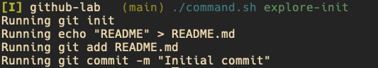
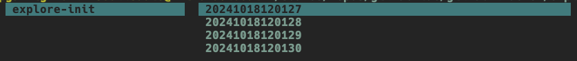
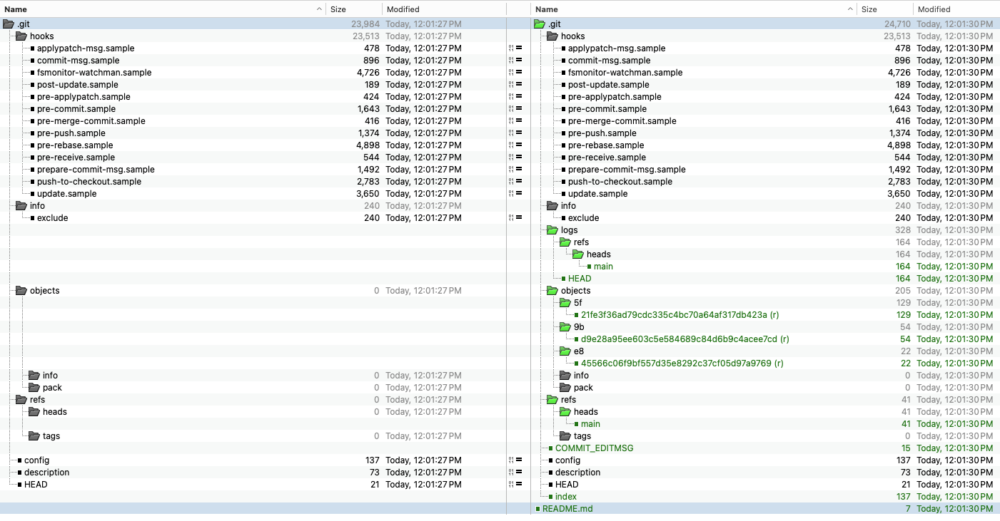
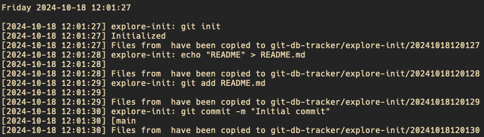

<div style="text-align: center;">
  
</div>

# GitHub Lab

`github-lab` is a collection of scripts and artifacts aimed at supporting GitHub analysis projects, specifically the analysis of repository changes over time. This repository contains tools to automate the creation, modification, and comparison of local Git repositories over time.

## Overview

One of the key scripts in this repository is `runner.sh`, which processes a list of Git commands stored in a file called `commands.gtd` (gtd = **g**i**t** **d**atabase). The main goal of the script combined with the command file is to 
- execute and log a series of Git commands
- record snapshots of the repository's state over time, storing them in a subdirectory called `snapshots`. The directories within `snapshots` are labeled using year-month-day-time so that they appear in order in the `snapshots` directory. 

Ultimately, the snapshots are used for comparison to understand how the `.git` directory changes relative to various git commands and working tree changes.

Sample `command.gtd` files are stored in the `commands` folder. Simply update `commands.gtd` with the contents of one of those, or create your own.

While there are other ways of accomplishing this that don't include taking physical snapshots, there is some convenience in reviewing changes this way.

## ⚠️ Caution
- **Warning**: `runner.sh` reads commands from `commands.gtd` to initialize, create artifacts, add items and commit based on the sample `commands.gtd` file. There aren't any precautions taken to sanitize what you put in commands.gtd. You can do very bad things if you're not careful, and many things not at all related to `git`.

<!-- ## ✨ Features

- **Separation of commands**: `runner.sh` reads commands from `commands.gtd` to initialize and manage a local Git repository based on the provided parameter. A sample `commands.gtd` file is included.
- **Snapshots**: The script periodically captures snapshots of the directory state, saving the snapshots in the `snapshots` subdirectory.
- **Customizable Git Commands**: The `commands.gtd` file can be customized with any sequence of Git commands or other shell commands that will be executed by `runner.sh`. -->

## Usage

1. **Prepare `commands.gtd`**: Create a `commands.gtd` file in the repository root, listing the commands you want to execute, including Git commands for initializing and managing a local repository. Be very cautious about what you include in this file! Be sure to include a newline at the end of the file.
   
   Example `commands.gtd`:
   ```bash
   git init
   echo "README" > README.md
   git add README.md
   git commit -m "Initial commit"
   ```
2. **Run runner.sh** `commands.gtd`**: `runner.sh` takes a parameter that is the name of the subdirectory you want to create.

   Example `runner.sh usage`:
   ```bash
   ./runner.sh explore-init
   ```

3. **Output**: `runner.sh` will iterate over `commands.gtd` executing the lines one-by-one. A snapshot of the directory will be taken with each successive command and placed in a subdirectory `snapshots/`. Here's an example run:

    

    The `explore-init` subdirectory is created in `snapshots` with a timestamped folder for each command. `20241018120127` corresponds to `git init`; `20241018120128` corresponds to `echo "README" > README.md`, etc. Using a comparison tool such as Beyond Compare, we can easily inspect the changes to the `.git` folder over time in the context of changes to the working tree and various `git` commands.

    

    Now we can visually compare `20241018120127` with `20241018120130` to understand the evolution of `.git`.

    

    A log can be found at script.log showing the items, results and snapshot directories.
    


## 🛠️ File Structure

- **runner.sh**: The main script that processes the commands.gtd file and manages the Git repository lifecycle.
- **commands.gtd**: A text file containing Git commands for runner.sh to execute.
- **snapshots/**: A subdirectory where snapshots of the Git repository are stored over time.